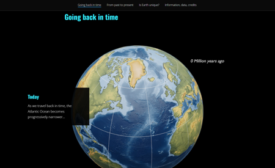

# Dance of the Continents



Watch millions of years of Earth's geological history unfold through interactive scroll-driven animation.

This enhanced ArcGIS StoryMaps project embeds a story via script and harnesses the page scroll event to create an introductory scrolly animation sequence.

<a href="https://leebock.github.io/dance-of-the-continents/" target="_blank">View it live</a>

## Features

* Scroll-driven frame animation - Over 200 jpg frames controlled by page scroll position
* Iframe integration - Seamlessly embeds within ArcGIS StoryMaps via postMessage communication
* Responsive viewport calculation - Accurate scroll progress accounting for different screen sizes

## Instructions

1. **Clone the repository**
   ```bash
   git clone https://github.com/leebock/dance-of-the-continents.git
   cd dance-of-the-continents
   ```

2. **Install dependencies**
   ```bash
   npm install
   ```

3. **Start development server**
   ```bash
   npm run dev
   ```

4. **Open in browser**
   - Main application: `http://localhost:5173`
   - Frame display: `http://localhost:5173/frames_display/`

## Requirements

### Technical Requirements
- **Node.js** (version 18 or higher)
- **npm** or **yarn** package manager
- **Modern web browser** (Chrome, Firefox, Safari, Edge)

### For ArcGIS StoryMaps Integration
- **ArcGIS Online account** or **ArcGIS Enterprise**
- **StoryMaps authoring privileges**

### Optional but Recommended
- **Git** for version control
- **VS Code** or similar code editor

## Resources

* [Introducing Story Embeds via Script!](https://www.esri.com/arcgis-blog/products/arcgis-storymaps/constituent-engagement/introducing-story-embeds-via-script) - ArcGIS Blog post explaining the script embedding technique used in this project

## Issues

Find a bug or want to request a new feature?  Please let us know by submitting an issue.

## Contributing

Esri welcomes contributions from anyone and everyone. Please see our [guidelines for contributing](https://github.com/esri/contributing).

## Licensing

Copyright 2025 Esri

Licensed under the Apache License, Version 2.0 (the "License");
you may not use this file except in compliance with the License.
You may obtain a copy of the License at

   http://www.apache.org/licenses/LICENSE-2.0

Unless required by applicable law or agreed to in writing, software
distributed under the License is distributed on an "AS IS" BASIS,
WITHOUT WARRANTIES OR CONDITIONS OF ANY KIND, either express or implied.
See the License for the specific language governing permissions and
limitations under the License.

A copy of the license is available in the repository's [LICENSE.txt](LICENSE.txt?raw=true) file.